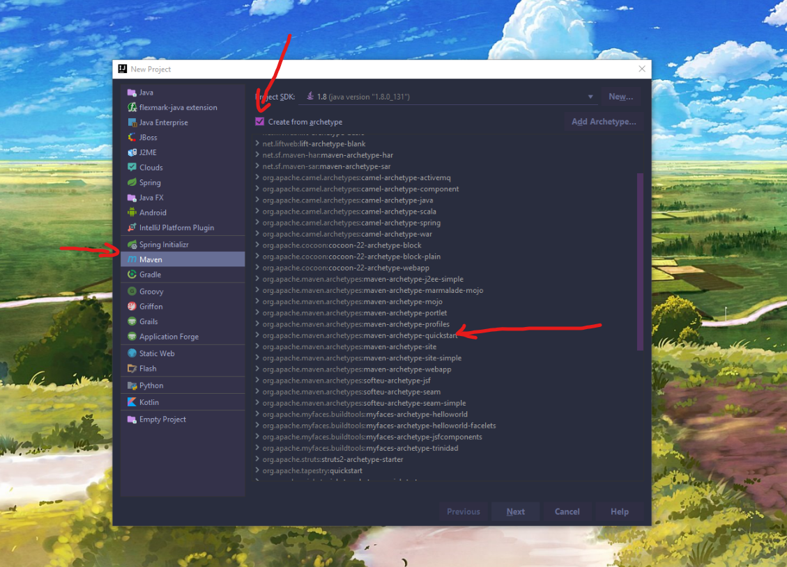
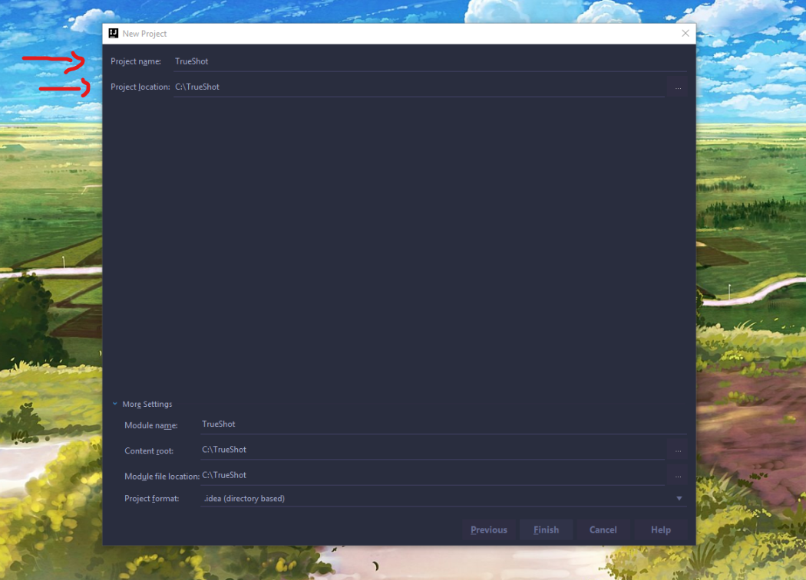
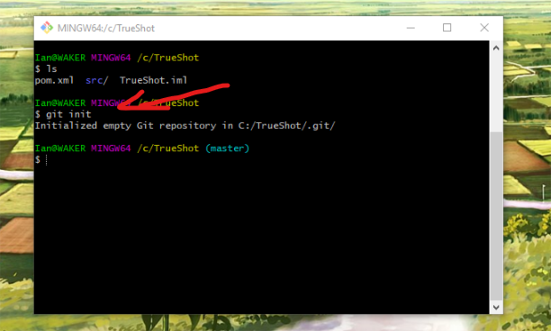
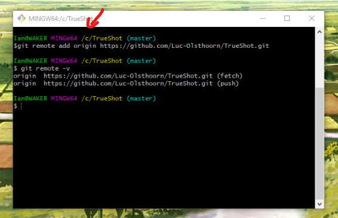
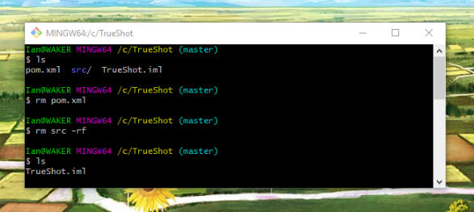
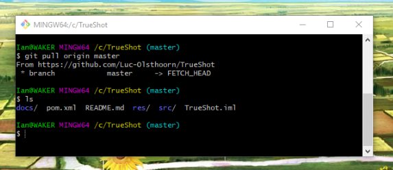
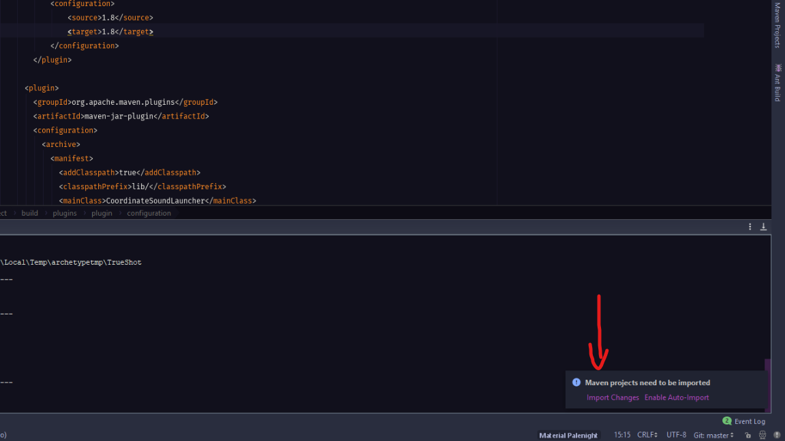

# TrueShot - 3D Sound Interface
TrueShot's goal is to give gunshot detection devices another interface for displaying their data to a user. It uses 3D sound to
convey coordinate locations and predictive information about the shooter.

The repository has been separated into two different modules: **lib** and **app**. Lib contains the meat of the 3D sound. Feel free to fork it if you want to apply
some 3D sound to your application, although at the moment it doesn't support much.


## Installation

#### Dependencies
* [Intellij](https://www.jetbrains.com/idea/) (community or pro)
* [Nd4j](https://nd4j.org/getstarted) Used for matrix manipulations
* System configuration requirements:

```
 Java Development Kit 1.7(64 Bit) or later
 Apache Maven 3.3.9 or later
 Above 0.7.2:

 JavaCPP
 BLAS (MKL or OpenBLAS)
 ```
Check the documentation at the link for easy install of Nd4j.


### Easiest way to get started:


#### Group ID and Artifact ID


Continue until you finish the wizard. We are grabbing files now.

#### Git Init


#### Git Remote


#### Remove Some Files


#### Git pull



#### Import the Maven changes



Everything should be working now. Go up and do `run -> edit configuration`.

Make sure you are using 64 Bit java and all dependencies have been imported.

